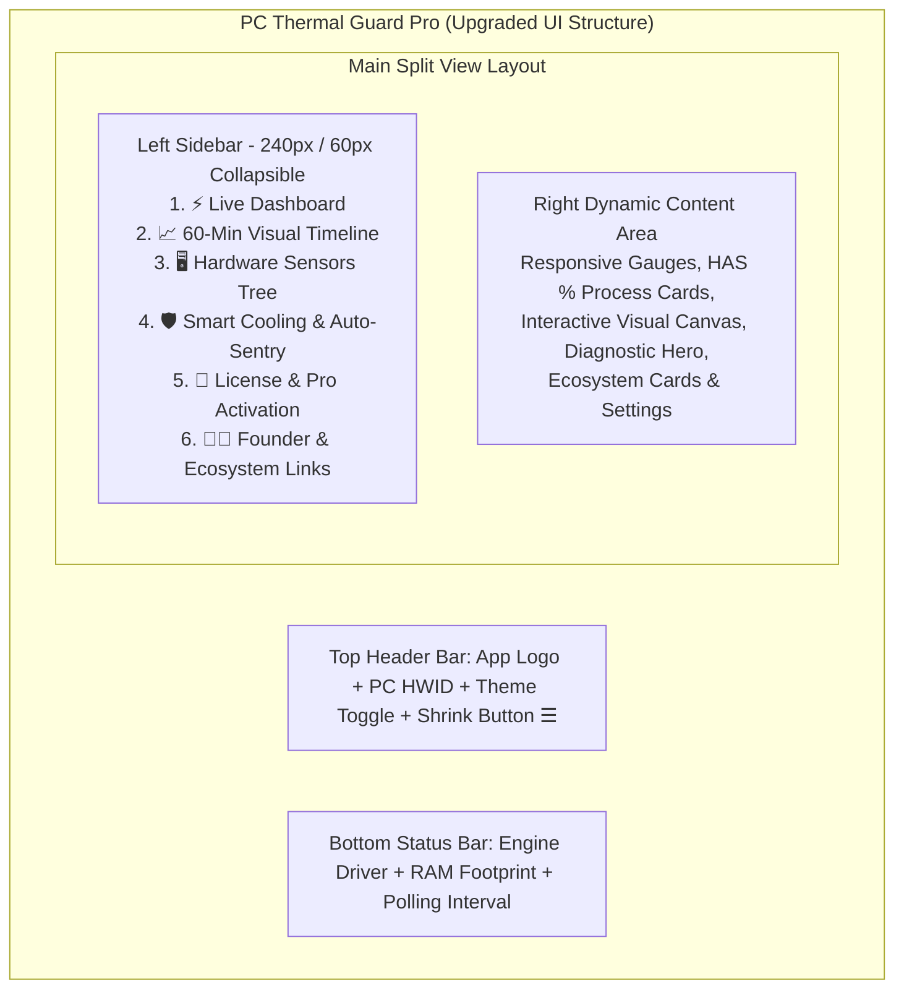

# 🎨 Smart File Organizer से सीखे गए UI/UX पैटर्न्स एवं PC Thermal Guard Pro का फ्रंटएंड अपग्रेड ब्लूप्रिंट
## (Frontend UI/UX Architectural Blueprint & Cross-Project Enhancement Strategy)

*Author: Master Manikant Yadav | FrankBase Desktop Suite Architecture*  
*Reference Source: D:\02_Desktop_and_Mobile_Apps\Smart_File_Organizer_Desktop*  
*Target Application: D:\02_Desktop_and_Mobile_Apps\PC_Thermal_Guard_Pro*

---

## 🧭 1. एग्जीक्यूटिव ओवरव्यू (Executive Overview)

`Smart File Organizer Desktop` का विश्लेषण करने पर यह स्पष्ट होता है कि इसका फ्रंटएंड आर्किटेक्चर एक साधारण टूल की तुलना में बहुत अधिक **इंटरैक्टिव, मॉड्यूलर और कमर्शियल-ग्रेड (Commercial-Grade)** है। 

उसमें इस्तेमाल किए गए 6 मुख्य UI/UX पिलर्स:
1. **Left-Side / Right-Side Split-View Layout (साइडबार + मेन कंटेंट)**
2. **Shrink & Expand Effect (साइडबार का छोटा-बड़ा होना - 240px से 60px)**
3. **PC Machine ID / Hardware Identification ("PC Number" कार्ड)**
4. **100% Offline RSA-2048 Licensing Engine & Activation Modal**
5. **Developer & Founder Credibility Card (मास्टर मणिकान्त यादव - ब्रांड ट्रस्ट)**
6. **Ecosystem Cross-Links & Product Store Integration (sister websites & upgrade CTA)**

नीचे विस्तार से बताया गया है कि इन सभी बेहतरीन फीचर्स को हम **PC Thermal Guard Pro** में बिना किसी परफॉर्मेंस लैग के कैसे जोड़ेंगे।

---

## 🏛️ 2. प्रस्तावित नया फ्रंटएंड लेआउट आर्किटेक्चर (New UI Architecture)



---

## 🚀 3. सीखे गए 6 मुख्य फीचर्स और उनका इम्प्लीमेंटेशन प्लान

---

### 🔹 1. Collapsible Sidebar (Shrink & Expand Effect - 240px $\leftrightarrow$ 60px)
* **Smart File Organizer से क्या सीखा?**
  - जब यूजर को बड़ा ग्राफ या विस्तृत हार्डवेयर ट्री देखना हो, तो साइडबार 240px से सिकुड़कर (Shrink) 60px का मिनी आइकन बार बन जाता है।
* **PC Thermal Guard Pro में कैसे लागू होगा?**
  - हेडर में एक **`☰` (Hamburger / Sidebar Toggle)** बटन रहेगा।
  - **Expanded Mode (240px):** पूरे टेक्स्ट और बैज के साथ नेविगेशन दिखेगा (जैसे `1. ⚡ Live Dashboard`, `2. 📈 Visual History`)।
  - **Collapsed Mode (60px):** केवल ग्लोइंग आइकन्स (`⚡`, `📈`, `🖥️`, `🛡️`, `🔑`, `👨‍💻`) दिखेंगे, जिससे ग्राफ एरिया 200px बड़ा हो जाएगा।

---

### 🔹 2. PC Number / Unique Hardware ID (HWID Card)
* **Smart File Organizer से क्या सीखा?**
  - मदरबोर्ड UUID और CPU सिग्नेचर से एक सुरक्षित `HWID` (जैसे `FB-PC-89A4-E102`) निकालना।
* **PC Thermal Guard Pro में कैसे लागू होगा?**
  - हेडर या लाइसेंस पैनल में यूजर का **"Unique PC Number / Hardware ID"** और उसके साथ **"📋 1-Click Copy ID"** बटन दिखेगा।
  - इसका उपयोग यूजर `store.frankbase.com` पर Pro लाइसेंस की जेनरेट करने के लिए कर सकता है।

---

### 🔹 3. 100% Offline RSA-2048 Pro License Activation Modal
* **Smart File Organizer से क्या सीखा?**
  - बिना किसी सर्वर, इंटरनेट या डेटा लीक के 100% ऑफलाइन पब्लिक की क्रिप्टोग्राफी (`cryptography.hazmat` / RSA-2048) द्वारा लाइसेंस एक्टिवेशन।
* **PC Thermal Guard Pro में कैसे लागू होगा?**
  - साइडबार में **"🔑 License & Upgrade"** टैब।
  - लाइसेंस विंडो में:
    - Current Status: `🟢 Community Edition (Free Forever)` या `⭐ Pro Lifetime Edition (Active)`.
    - "Enter License Key" इनपुट बॉक्स + "Activate Pro" बटन।
    - प्रो वर्जन एक्टिवेट होते ही **Auto-Sentry Background Cooling** और **AI Voice Alarms** अनलॉक हो जाएंगे।

---

### 🔹 4. Developer & Founder Credibility Card (ब्रांड ट्रस्ट)
* **Smart File Organizer से क्या सीखा?**
  - ऐप के अंदर सीधे फाउंडर और ऑर्गेनाइजेशन का प्रामाणिक परिचय जिससे यूजर का विश्वास 10x बढ़ता है।
* **PC Thermal Guard Pro में कैसे लागू होगा?**
  - साइडबार के बॉटम में या अबाउट पैनल में:
    - **Developer Card:** **Master Manikant Yadav** (Founder & System Architect).
    - **Official Desk Email:** `connect@mastermanikant.com` (Rule 9 PII Compliance - No Private Gmail).
    - **Verified Brand Badge:** *"FrankBase Ecosystem Certified System Utility"* (Rule 14 Compliance - 100% Factual).

---

### 🔹 5. Ecosystem Sister Websites & Product Store Integration
* **Smart File Organizer से क्या सीखा?**
  - यूजर को डिस्टर्ब किए बिना ऐप के अंदर आधिकारिक वेबसाइट्स और डिजिटल प्रोडक्ट्स के 1-क्लिक हाइपरलिंक बटन।
* **PC Thermal Guard Pro में क्या लिंक्स जुड़ेंगे?**
  - 🌐 **Official Portal:** `mastermanikant.com`
  - 🛍️ **Digital Store:** `store.frankbase.com` (Ebooks, Software Kits, Worksheets)
  - 🏢 **Digital Agency:** `digital.frankbase.com` (Custom Software & Web Development)
  - 📚 **Educational Hub:** `englishvidya.com` (Sister Ecosystem)
  - 🔒 **Privacy & Ethics:** `store.frankbase.com/review` & `store.frankbase.com/report-piracy` (Rule 23 Compliance).

---

### 🔹 6. Quick Hardware Action Dropdowns & Mode Pills
* **Smart File Organizer से क्या सीखा?**
  - कस्टम पिल्स और ड्रॉपडाउन मेनू (Segmented Buttons) से मोड्स बदलना।
* **PC Thermal Guard Pro में क्या ऑप्शन्स मिलेंगे?**
  - **Cooling Profile Mode Pill:**
    - `Quiet (Eco)` | `Balanced (Default)` | `Turbo (Gaming/Rendering)`
  - **Polling Frequency Dropdown:**
    - `0.5s (Real-Time Ultra)` | `1.0s (Balanced - Standard)` | `2.0s (Battery Saver)`
  - **Temperature Unit Toggle:**
    - `°C (Celsius)` $\leftrightarrow$ `°F (Fahrenheit)`

---

## 🎨 4. मॉडर्न UI विजुअल स्टाइलिंग टोकन्स (Visual Enhancements)

```css
/* PC Thermal Guard Pro - Enhanced Modern Tokens */
:root {
  --sidebar-width-expanded: 240px;
  --sidebar-width-collapsed: 60px;
  --card-corner-radius: 12px;
  --glassmorphism-bg: rgba(30, 41, 59, 0.75);
  --glassmorphism-border: 1px solid rgba(56, 189, 248, 0.2);
  --active-nav-glow: #38bdf8;
  --badge-pro: linear-gradient(135deg, #f59e0b, #ea580c);
}
```

---

## 🛠️ 5. स्टेप-बाय-स्टेप इम्प्लीमेंटेशन प्लान (Step-by-Step Execution Plan)

1. **Step 1: Modular Sidebar Component (`src/ui/sidebar_view.py`):**
   - 240px $\leftrightarrow$ 60px टॉगल के साथ नेविगेशन बटन्स और इकोसिस्टम लिंक्स।
2. **Step 2: Machine ID & Hardware Fingerprint Engine (`src/core/machine_id.py`):**
   - WMI / Motherboard UUID से 16-कैरेक्टर का क्लीन PC Hardware ID जनरेट करना।
3. **Step 3: RSA-2048 Offline Licensing Module (`src/core/licensing.py`):**
   - `Smart File Organizer` के लाइसेंसिंग मॉडल को `PC Thermal Guard Pro` में अडैप्ट करना।
4. **Step 4: Enhanced Main Window Layout (`src/ui/main_window.py`):**
   - हेडर, श्रिंक-साइडबार, मेन कंटेनर और स्टेटस बार को नए ग्रिड सिस्टम में जोड़ना।
5. **Step 5: Developer & Ecosystem About Card (`src/ui/about_view.py`):**
   - फाउंडर कार्ड, सिस्टर इकोसिस्टम बटन्स और प्रोडक्ट अपग्रेड लिंक जोड़ना।
6. **Step 6: Local Git Checkpoint & Final Executable Rebuild.**

---

## 🏁 6. निष्कर्ष (Conclusion)

`Smart File Organizer` के इन समृद्ध UI/UX और आर्किटेक्चरल पैटर्न्स को अपनाने से **PC Thermal Guard Pro** एक सामान्य हार्डवेयर मॉनिटर से बदलकर **एक संपूर्ण, कमर्शियल-ग्रेड और अत्यधिक आकर्षक फ्लैगशिप सॉफ्टवेयर** बन जाएगा! 🚀⚡