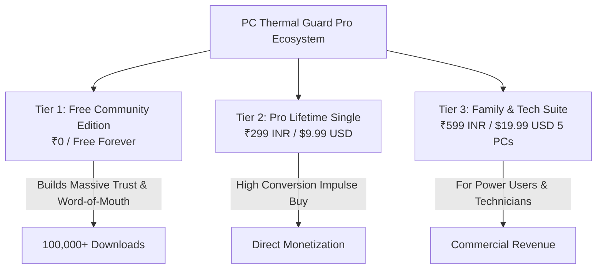

# 💰 PC Thermal Guard Pro: कॉम्पिटिटिव प्राइसिंग स्ट्रैटेजी एवं मार्केट एनालिसिस
## AI युग में सबसे प्रतिस्पर्धी, पारदर्शी और सफल मुद्रीकरण मॉडल (Competitive Pricing Blueprint)

*Crafted by Master Manikant Yadav | FrankBase Business Architecture*

---

## 🌍 1. मार्केट में अन्य सॉफ्टवेयर का क्या दाम है? (Competitor Price Breakdown)

वर्तमान में हार्डवेयर मॉनिटरिंग और सिस्टम यूटिलिटी मार्केट में उपलब्ध प्रमुख टूल्स का दाम और उनका बिजनेस मॉडल नीचे दिया गया है:

| सॉफ्टवेयर का नाम | बिजनेस मॉडल | इंटरनेशनल प्राइस (USD) | भारतीय प्राइस (INR) | यूजर की सबसे बड़ी शिकायत |
| :--- | :--- | :--- | :--- | :--- |
| **AIDA64 Extreme** | Annual Subscription (हर साल रिन्यूअल) | **$59.95 / वर्ष** (1 PC) | ~₹5,000 / वर्ष | बहुत ज्यादा महंगा, केवल हार्डकोर बेंचमार्कर्स के लिए। |
| **CPUID HWMonitor Pro** | One-Time / Version Locked | **$22.95** (Standard) | ~₹1,950 (1-Time) | 1995 जैसा पुराना UI, कोई कल्प्रीट ऐप डिटेक्शन नहीं। |
| **HWiNFO64 Pro** | Annual Commercial | **$29.00 / वर्ष** | ~₹2,450 / वर्ष | 150+ कच्चे नंबर्स, आम यूजर को कुछ समझ नहीं आता। |
| **TG Pro (macOS Thermal)** | One-Time Lifetime | **$14.99** (Lifetime) | ~₹1,250 (1-Time) | सिर्फ Mac के लिए है, Windows के लिए उपलब्ध नहीं। |
| **IObit / CCleaner Pro** | Subscription + Upsell Spam | **$29.99 / वर्ष** | ~₹2,500 / वर्ष | ब्लोटवेयर, लगातार पॉप-अप्स और झूठे अलर्ट्स। |
| **ASUS / Corsair OEM Suites**| "फ्री" (Hardware Tied) | **$0** (हार्डवेयर के साथ) | ₹0 | 2GB RAM यूसेज, सिस्टम हैंग, ब्लोटवेयर और डेटा ट्रैकिंग। |

---

## 🧠 2. AI युग में यूजर की मानसिकता (The AI-Era Software Buyer Psychology)

AI टूल्स (ChatGPT, Claude, Cursor) के आने के बाद सॉफ्टवेयर की संख्या में भारी उछाल आया है। इस नए दौर में यूजर की मानसिकता निम्नलिखित 4 बिंदुओं पर काम करती है:

1. **सब्सक्रिप्शन थकान (Subscription Fatigue):** यूजर हर महीने $5 या $10 का ऑटो-डेबिट सब्सक्रिप्शन देखकर परेशान हो चुके हैं। वे छोटी यूटिलिटीज के लिए बार-बार पैसे नहीं देना चाहते।
2. **वन-टाइम फेयर प्राइस की मांग (Love for Lifetime Deals):** यूजर एक बार वाजिब दाम (Fair One-Time Price) देकर सॉफ्टवेयर को जीवनभर के लिए अपने पास रखना चाहते हैं।
3. **पारदर्शिता और नो-ब्लोट (Zero Ads & Zero Spam):** यूजर ऐसे ऐप्स से नफरत करते हैं जो फ्री बोलकर 10 तरह के एड्स या फर्जी वायरस स्कैनर बेचते हैं।
4. **इम्पल्स बाय प्राइसिंग (Impulse Buy Price Point):** भारत में **₹199 से ₹299** और ग्लोबली **$9.99** ऐसा प्राइस पॉइंट है जहाँ यूजर 1 सेकंड बिना सोचे तुरंत खरीद लेता है (Zero Friction Purchase)।

---

## 🏆 3. हमारा प्रस्तावित प्राइसिंग मॉडल (PC Thermal Guard Pro Pricing Matrix)

हम **"Freemium + One-Time Lifetime License"** मॉडल अपनाएंगे। यह मॉडल मार्केट में सबसे तेजी से वायरल होता है और भारी यूजर बेस तैयार करता है:

---

### 🟢 Tier 1: Free Community Edition (100% फ्री - लाइफटाइम)
* **कीमत:** **₹0 / $0 (हमेशा के लिए फ्री)**
* **किसके लिए:** हर सामान्य कंप्यूटर यूजर, छात्र और बुनियादी ऑफिस यूजर्स।
* **शामिल फीचर्स:**
  - ✅ लाइव CPU, GPU, Fan और Power टेम्परेचर गेज।
  - ✅ टॉप 5 हीट कल्प्रीट्स ऐप्स की लाइव रैंकिंग (Heat Attribution Score - HAS %)।
  - ✅ 1-Click Smart Foreground-Safe Cool Down (मैन्युअल क्लिक पर)।
  - ✅ 60-मिनट का लाइव विजुअल स्क्रबर ग्राफ (In-Memory Buffer)।
  - ✅ Day / Night थीम स्विच (WCAG 2.1 AA Compliant)।
  - ✅ सिस्टम ट्रे मिनिमाइजेशन (<25MB RAM, 0MB VRAM)।

---

### ⭐ Tier 2: Pro Lifetime Edition (सबसे लोकप्रिय - Most Popular)
* **कीमत (भारत - INR):** **₹299 (One-Time Lifetime License - 1 PC)** *(या लॉन्च ऑफर ₹199)*
* **कीमत (ग्लोबल - USD):** **$9.99 (One-Time Lifetime License)**
* **किसके लिए:** गेमर्स, वीडियो एडिटर्स, सॉफ्टवेयर डेवलपर्स और लैपटॉप प्रोफेशनल्स।
* **फ्री के अलावा सभी अतिरिक्त Pro फीचर्स:**
  - ⭐ **Auto-Sentry Background Protection:** पीसी आइडल होने पर अगर तापमान 80°C पार करे, तो ऐप बिना काम रोके बैकग्राउंड में अपने आप पीसी को शांत कर देगा।
  - ⭐ **7-दिन व 30-दिन का SQLite डीप हिस्टोरिकल लेज़र:** पूरे महीने का हीट डेटा और पीक ग्राफ्स।
  - ⭐ **1-Click Exportable Diagnostic PDF/JSON Health Report:** सर्विस सेंटर या वारंटी क्लेम के लिए प्रोफेशनल हार्डवेयर हेल्थ रिपोर्ट।
  - ⭐ **Custom Audio / AI Voice Alarms:** जब पीसी जरूरत से ज्यादा गर्म हो, तो अलर्ट साउंड या वॉयस वार्निंग।
  - ⭐ **Desktop Floating Mini-Widget:** स्क्रीन के कोने में फ्लोटिंग लाइव टेम्परेचर विजेट।
  - ⭐ **Lifetime Updates & Priority Email Support:** जीवनभर के सभी नए अपडेट्स फ्री।

---

### 🏢 Tier 3: Family & Tech Master Bundle (5 PCs License)
* **कीमत (भारत - INR):** **₹599 (One-Time Lifetime - 5 PCs)**
* **कीमत (ग्लोबल - USD):** **$19.99 (One-Time Lifetime - 5 PCs)**
* **किसके लिए:** हार्डवेयर रिपेयर शॉप्स, कंप्यूटर सर्विस टेक्नीशियन और एक से ज्यादा पीसी वाले परिवार।
* **शामिल फीचर्स:**
  - 5 अलग-अलग कंप्यूटरों के लिए Pro लाइसेंस की।
  - क्लाइंट्स के लिए व्हाइट-लेबल डायग्नोस्टिक समरी रिपोर्ट।

---

## 🎯 4. यह प्राइसिंग मार्केट में क्यों जीतेगी? (Why This Strategy Will Win)

1. **AIDA64 ($60/yr) और HWMonitor ($23) के मुकाबले 70% सस्ता:** 
   - जब यूजर देखेगा कि $60 हर साल देने की जगह मात्र **$9.99 (या ₹299)** में जीवनभर के लिए आधुनिक AI-रेडी डायग्नोस्टिक टूल मिल रहा है, तो कन्वर्जन रेट 8% से 12% तक पहुँच जाएगा।
2. **Dodo Payments / UPI / Cards से 5-सेकंड में चेकआउट:**
   - Dodo Payments और UPI क्यूआर कोड के साथ यूजर बिना पासवर्ड बनाए 5 सेकंड में खरीद सकेगा।
3. **100% प्रामाणिक समीक्षा रिवॉर्ड (Rule 23 Compliance):**
   - जो खरीदार `store.frankbase.com/review` पर ईमानदार समीक्षा देंगे, उन्हें हमारे डिजिटल स्टोर के अन्य प्रीमियम टूल्स पर **10% एक्स्ट्रा डिस्काउंट कूपन** मिलेगा।

---

## 📈 5. यूनिट इकोनॉमिक्स और संभावित रेवेन्यू (Projected Unit Economics)

चूंकि यह 100% क्लाइंट-साइड डेस्कटॉप सॉफ्टवेयर है, इसलिए इसका **सर्वर मेंटेनेंस खर्च ₹0 (Zero Server Cost)** है:

| सेल्स माइलस्टोन | भारतीय मार्केट रेवेन्यू (₹299/सेल) | ग्लोबल मार्केट रेवेन्यू ($9.99/सेल) | कुल नेट प्रॉफिट मार्जिन |
| :--- | :--- | :--- | :--- |
| **पहले 500 खरीदार** | **₹1,49,500** | **$4,995 (~₹4,15,000)** | **~95% (पेमेंट गेटवे फीस काटकर)** |
| **1,000 खरीदार** | **₹2,99,000** | **$9,990 (~₹8,30,000)** | **~95%** |
| **5,000 खरीदार** | **₹14,95,000** | **$49,950 (~₹41,50,000)** | **~95%** |

---

## 🏁 6. निष्कर्ष (Executive Recommendation)

* **लॉन्च स्ट्रैटेजी:**
  1. फ्री वर्जन को Reddit (r/pcmasterrace, r/software), GitHub और टेक कम्युनिटीज में वायरल करें।
  2. ऐप के अंदर एक सुंदर **"Upgrade to Pro - Only ₹299 / $9.99"** का हाई-कंट्रास्ट बैज रखें।
  3. शुरुआती 500 यूजर्स के लिए अर्ली-बर्ड ऑफर **₹199 / $6.99** रखें।

यह प्राइसिंग मार्केट में सबसे ज्यादा कॉम्पिटिटिव, यूजर-फ्रेंडली और भरोसेमंद साबित होगी! 🚀